# Business Problem

A hedge fund is seeking alternative asset classes to invest for its investors.  The hedge fund, which will remain anonymous, is already diversified across multiple asset classes - which includes equity, fixed incomes, real estate, and commodities.  The hedge fund has observed that retail and institutional investors have generated positive returns via cryptocurrency.  As a result, this hedge fund is requesting KBO Analytics to create a model that can predict Bitcoin prices in the future.

# Data Understanding

The data for examing the aforementioned problem comes from the following source: [Coin Codex](https://coincodex.com/crypto/bitcoin/historical-data/)

Before beginning to create any type of time series model, I want to examine and become familiar with the dataset. I will conduct exploratory data analysis in order to understand the dataset attributes, which includes, but not limited to the following:

1. Number of Columns
2. Number of Rows
3. Column Names
4. Format of the data in each column

# Data Preparation

I have completed my exploratory data analysis (EDA).  Based on the analytics, the dataset contains a total of 4,531 rows.  There are a total of 8 columns, which are the following:

- *Start* - Start Date
- *End* - End Date
- *Open* - Opening (Bitcoin) Price (for the day)
- *High* - Highest (Bitcoin) Price (for the day)
- *Low* - Lowest (Bitcoin) Price (for the day)
- *Close* - Closing (Bitcoin) Price (for the day)
- *Volume* - 24-hour (Bitcoin) trading volume (for the day)
- *Market Cap* - Market capitalization (of Bitcoin) for the day

I will use the Start Date and Closing Price to create the time series models.  As a result, I will remove the following columns: *End*, *Open*, *High*, *Low*, *Volume*, and *Market Cap*.

I also noticed that the first row of data pertains to a Start Date and End Date of January 1st, 2026; and January 2nd, 2026, respectively.  The last row of data pertains to a Start Date and End Date of January 5th, 2014; and January 6th, 2014.  I will need to invert the row order of the dataset before proceeding to the modeling stage.

The *Start* column is in a string format.  I want to convert the aforementioned column to a date format since the column is capturing time.

Finally, I will relabel the columns.  I will rename the *Start* column to *Date*.  I will also rename the *Close* column to *Price*.

# Modeling

The data preparation state is complete.  I will transition towards the modeling stage.  To be specific, I will create a series of four time series models, and select the best one to predict Bitcoin prices in the future.  The four categoeis of times series models are the following:

**1. Naive Forecast**  This time series model uses the previous data points to predict the next data points.  The Naive forecast serves as a baseline model of comparison for other time series models.

**2. Moving Average**  This time series model is based on past forecast errors instead of the past data points.  The forecast errors can be referred to as residuals or *shocks*.  Within time series modeling, the forecast errors last for a finite error of steps and eventually disappear.  The objective of creating a moving average time series model is to create another baseline model of comparison.

**3. ARIMA**  The ARIMA Model is more complex than the Naive Forecast and Moving Average Models.  There are three variables that make up the ARIMA model, which are the following:

- Auto Regressive (AR) (denoted as *p*) - in the same manner as the Naive Forecast, this variable references the number of lagged data points to forecast future data points.  As an example, if one lagged data point is utilized in the forecast, then *p* is equal to 1.

- Stationarity (I) (denoted as *d*) - this references the amount of differencing required to remove non-stationary trends.  In order to successfully create an ARIMA model, the data needs to be stationary.  In other words, the data needs to have a constant average, constant variance (the spread between the actual data point and forecasted data point remains constant), and constant autocorrelation (the relationship between past observations and current observations only depends on time).  Differencing is the actual transformation that turns non-stationary data into stationary data.

- Moving Average (MA) (denoted as *q*) - this is the same Moving Average as highlighted in the aforementioned Moving Average Model section.

In summary, I will manually attempt to create an ARIMA model based on the following three values:

- *p*: Trend Autoregression Order
- *d*: Trend Difference Order
- *q*: Trend Moving Average Order

**4. Auto-ARIMA** I will create another set of time series models based on the Auto-ARIMA function within the Statsmodel library. 

## Naive Forecast ##

### Naive Forecast ###

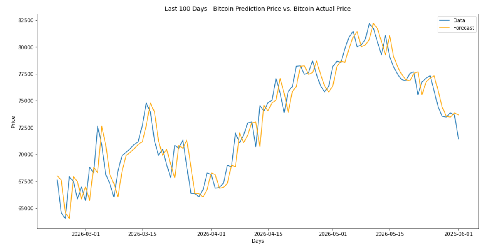

### Naive Forecast (with Log Transformation) ###

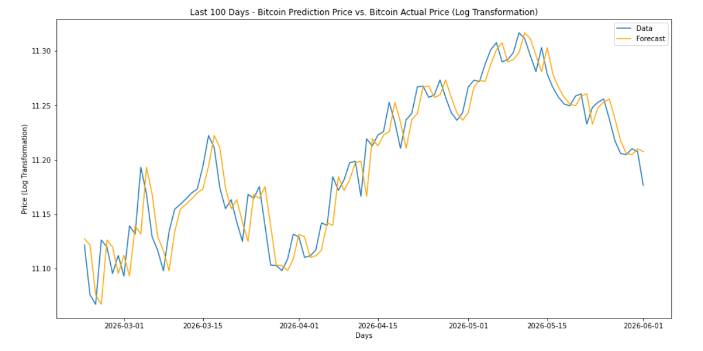

### Naive Forecast | Conclusion ###

The RMSE numbers for the Niave Forecast and Naive Forecast with Log Transformation Models are the following:

- RMSE for Naive Forecast Model: 1950.8803
- RMSE for Naive Forecast Model with Log Transformation: 0.0222

Since the Naive Forecast with Log Transformation has the smaller RMSE number, it is the best performing Naive Forecast Model.

## Moving Average ##

I have concluded create Naive Forecast models.  I want to create another set of time series models - Moving Average - which will serve as another baseline.

The Moving Average models will be the following:

- Moving Average (q=2)
- Moving Average (q=5)
- Moving Average with Log Transformation (q=2)
- Moving Average with Log Transformtion (q=5)

### Moving Average (d=2) ###

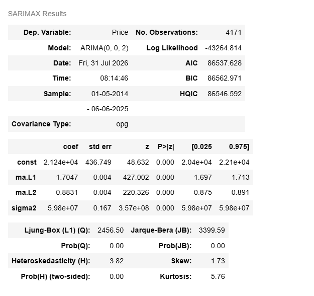

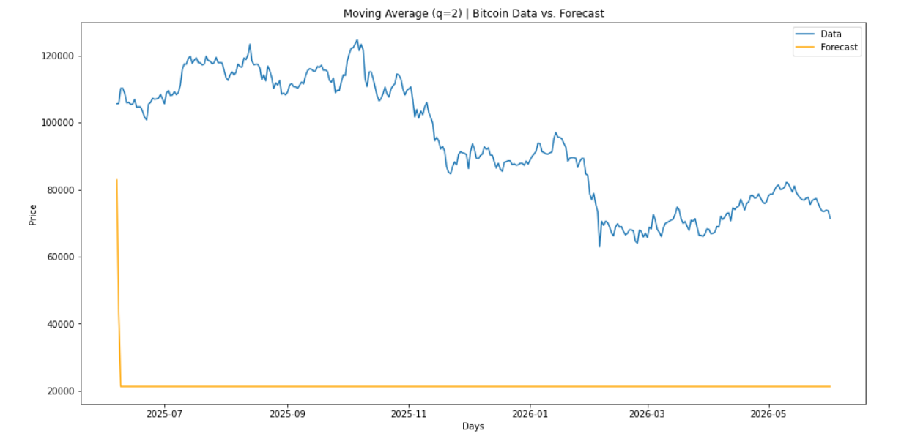

### Moving Average (q=5) ###

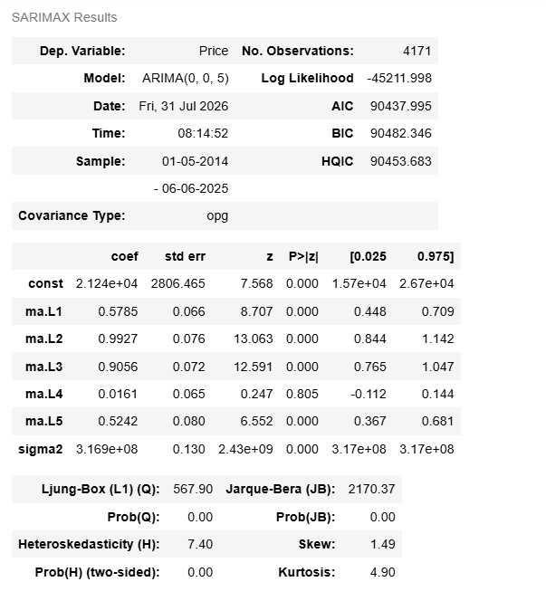

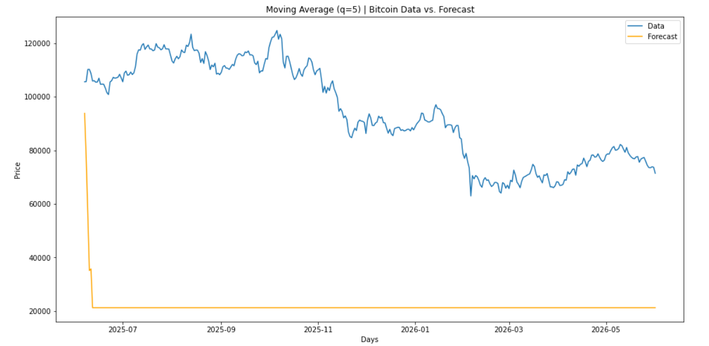

### Moving Average (q=2) with Log Transformation  ###

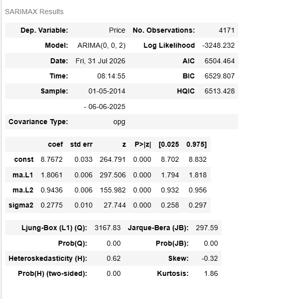

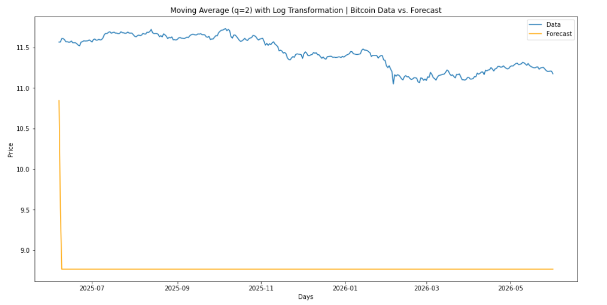

### Moving Average with Log Transformation (q=5) ###

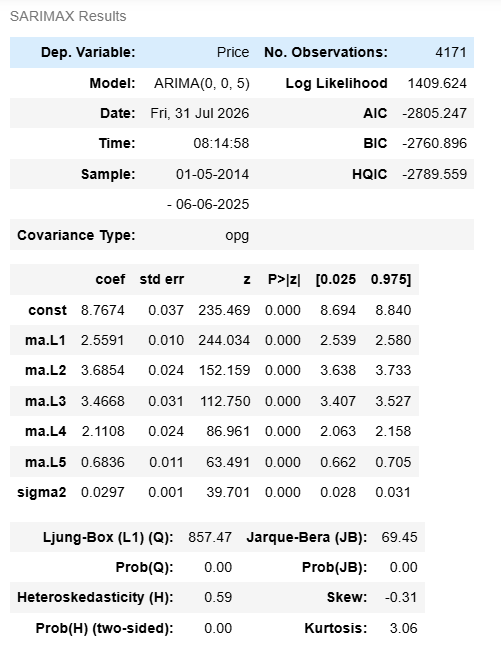

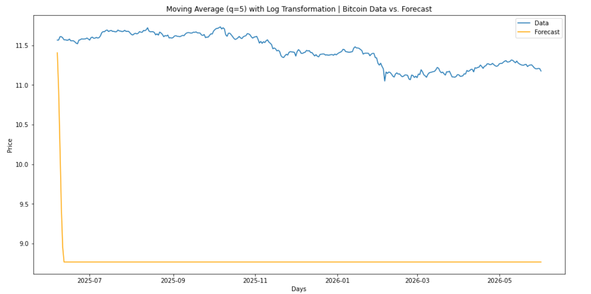

### Moving Average | Conclusion ### 

The RMSE numbers for the Moving Average Models are the following:

- RMSE for Moving Average (q=2) Model: 74823.3599
- RMSE for Moving Average (q=5) Model: 74581.9663
- RMSE for Moving Average (q=2) Model with Log Transformation: 2.6663
- RMSE for Moving Average (q=5) Model with Log Transformation: 2.6584

Since the Moving Average (q=5) Model with Log Transformation has the smaller RMSE number, it is the best performing Moving Average Model.

## ARIMA ##

### ARIMA ###

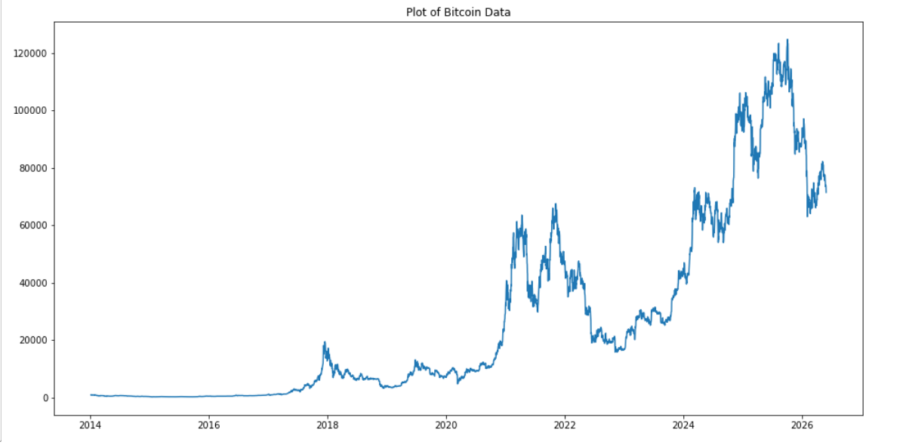

Based on the plot, Bitcoin prices have an upward trend.  However, the trend is not linear.  As a result, I am going to difference the data two times.

I performed the Dicky Fuller test.  And the p-value result is 0.0.  Since the p-value result is less than 0.05, statistical significance has been achieved.  In other words, stationarity has been achieved.  As a result, *d* will be set to 2 for the ARIMA model.

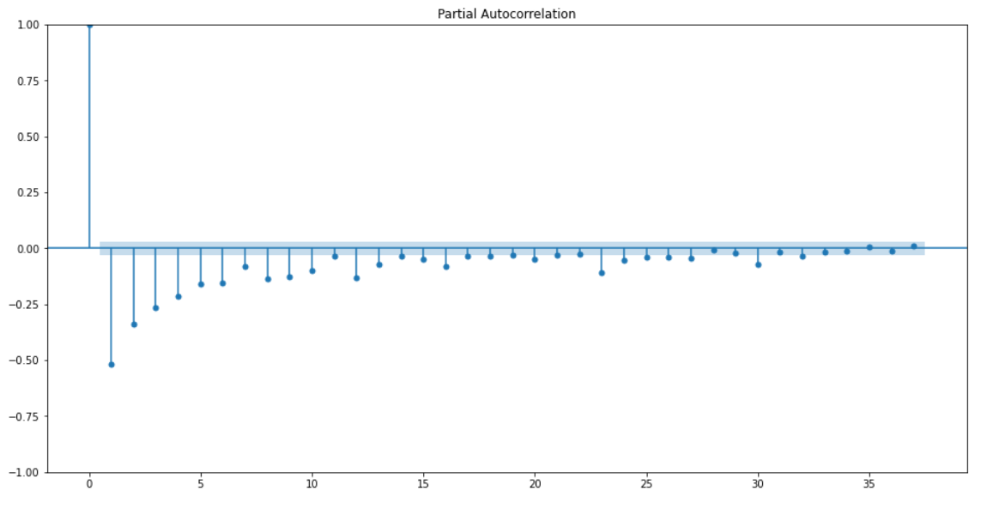

The PACF plot has a negative spike at 1.  However, the negative gradually approaches 0.  As a result, I will set *p* to 0 for the ARIMA model.

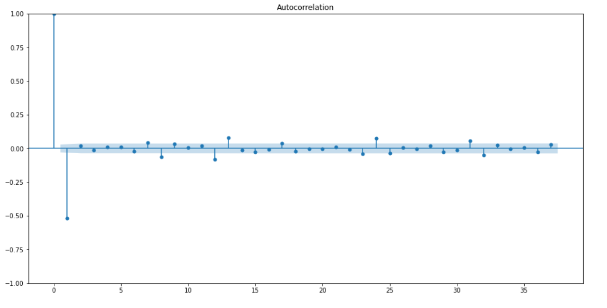

The ACF plot has a negative spike at 1.  Afterwards, the ACF plot are close to zero.  As a result, I will set *q* to 1 for the ARIMA model.

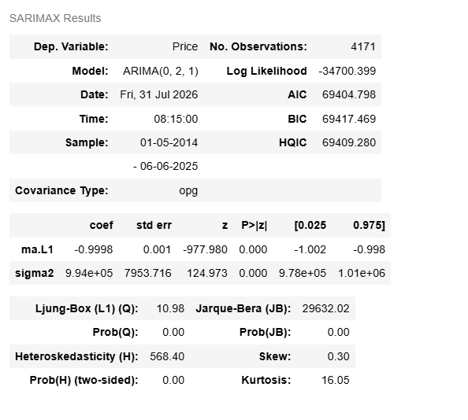

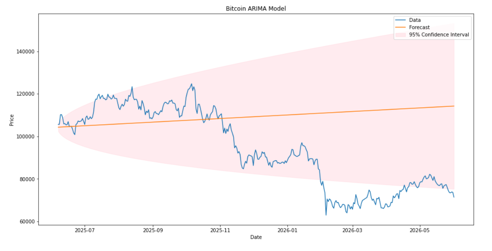

### ARIMA with Log Transformation ###

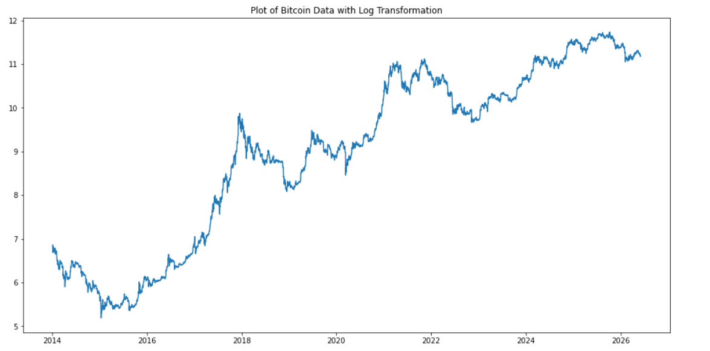

Based on the visual plot, the Bitcoin price increase is not perfectly linear.  However, the plot exhibits characteristics of linearity.  As a result, I will difference the data one time and apply the Dicky Fuller test.

I performed the Dicky Fuller test.  And the p-value result is 0.0.  Since the p-value result is less than 0.05, statistical significance has been achieved.  In other words, stationarity has been achieved.  As a result, *d* will be set to 1 for the ARIMA model.

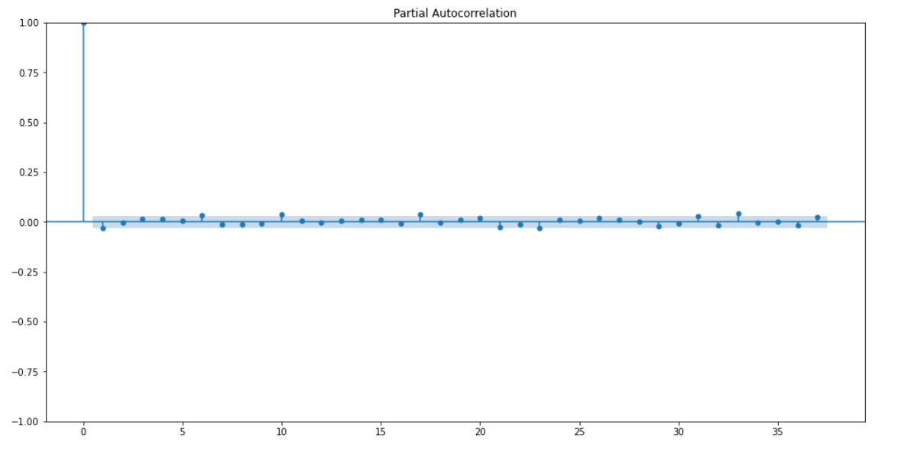

The PACF plot approaches zero after 0.  As a result, I will set *q* to 0 for the ARIMA model with log transformation.

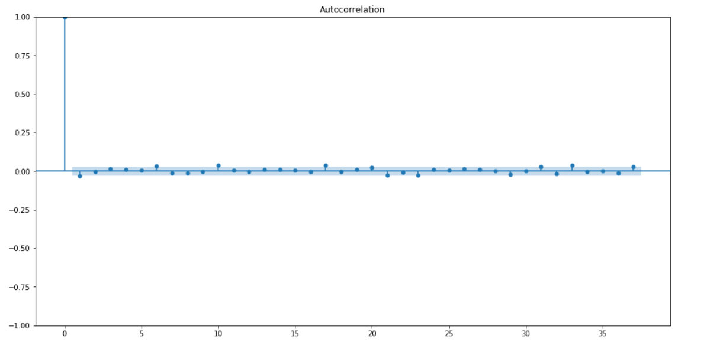

The ACF plot approaches zero after 0.  As a result, I will set *q* to 0 for the ARIMA model with log transformation.

I have finished calcculating the values for the *p*, *d*, and *q* variables.  Based on the work in this section, the ARIMA model with log transformation have *p*, *d*, and *q* values of 0, 1, and 0, respectively.  Theese *p*, *d*, and *q* values are equivalent to the values for a Naive Forecast model.  As a result, I will not pursue creating the ARIMA model with log transformation any further.  

### ARIMA | Conclusion ###

I only created one ARIMA Model, which had a RMSE of 25719.22.  By default, it is the best time series model for this section.

## Auto-ARIMA ##

### Auto-ARIMA ###

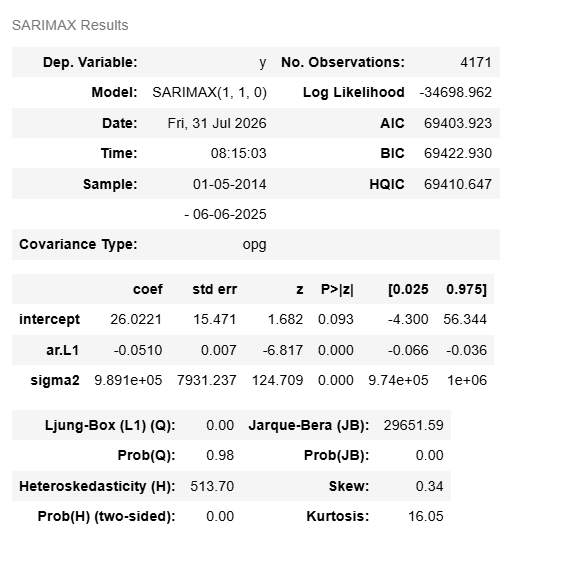

Based on the model summary for the Bitcoin Auto ARIMA model, the values for *p*, *d*, and *q* are 1, 1, and 0, respectively.

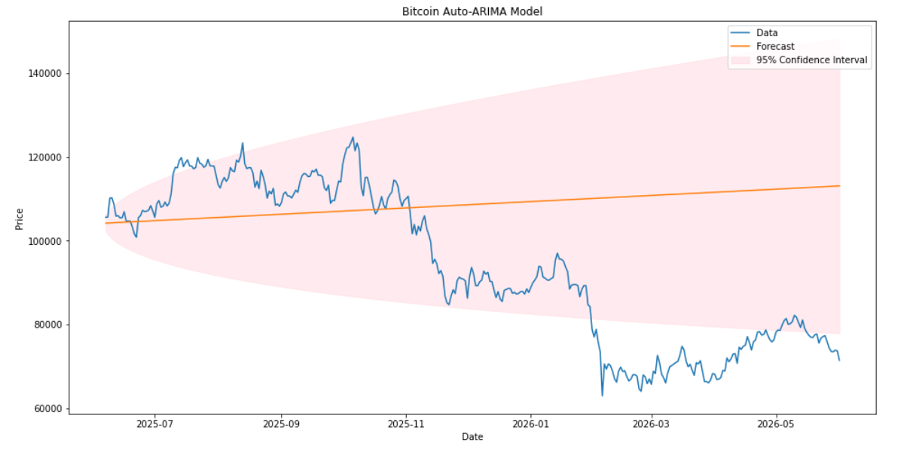

### Auto-ARIMA with Log Transformation ###

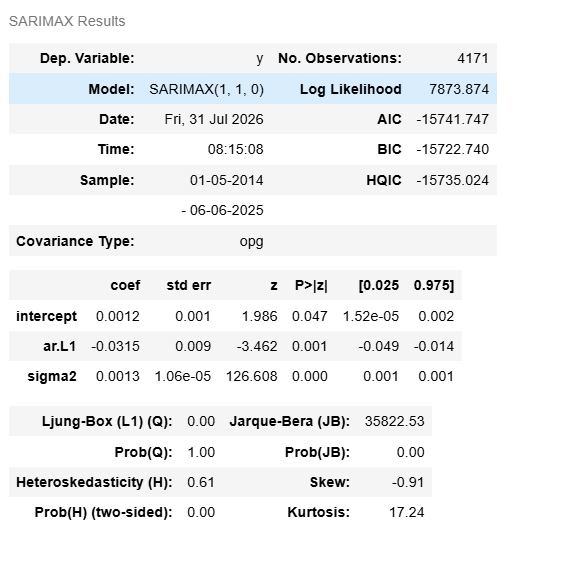

Based on the model summary for the Bitcoin Auto ARIMA model with log transformation, the values for *p*, *d*, and *q* are 1, 1, and 0, respectively.

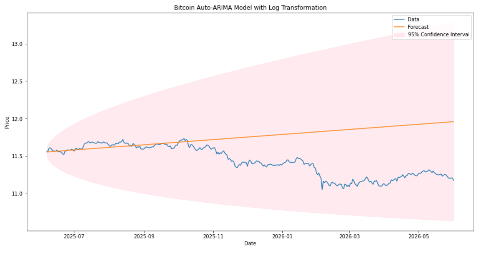

### Auto-ARIMA | Conclusion ###

The RMSE numbers for the Auto-ARIMA Models are the following:

- RMSE for Auto-ARIMA Model: 25123.21
- RMSE for Auto-ARIMA Model with Log Transformation: 0.45 

Since the Auto-ARIMA Model with Log Transformation has the smaller RMSE number, it is the best performing Auto-ARIMA Model.

# Overall Conclusion and Recommendations

## Overall Conclusion and Recommendations

The best performing models from each Modeling Section are the following:

- RMSE for Naive Forecast Model with Log Transformation (Best Naive Forecast Model): 0.0222
- RMSE for Moving Average (q=5) Model with Log Transformation (Best Moving Average Model): 2.6584
- RMSE for ARIMA Model (Best ARIMA Model): 25719.2278
- RMSE for Auto-ARIMA Model with Log Transformation (Best Auto-ARIMA Model): 0.4469

The best performing model overall is the Naive Forecast Model with Log Transformation.  Since the Naive Forecast Model is the best performing model based on RMSE, the translation is that the data has high volatility with no predictable trends or reliable signals.

## Next Steps

### Additional Data

Bitcoin launched in January 2009.  The year is presently 2026, and Bitcoin continues to trade 24 hours each day.  After the Naive Forecast Model with Log Transformation (RMSE = 0.0222), the best performing model was the Auto-ARIMA Model with Log Transofrmation (RMSE = 0.4469).  There will be more opportunities to collect additional data and create an ARIMA model that performs better than the aforementioned Naive Forecast Model.

### Institutional Investment

Institutional investment has recently increased for Bitcoin.  For example, in 2025, Coinbase Derivatives became the first Commodities Futures Trading Commission (CFTC) regulated futures exchange to offer 24/7 trading for margined future contracts.  The Coinbase Derivatives offering includes Bitcoin futures.  And in 2026, Blackrock and Morgan Stanley launched Bitcoin Exchange Traded Funds (ETFs) in 2026.

As institutional interest and investment in Bitcoin increases, this may reduce its volatility.  In turn, this creates more opportunities to model Bitcoin price behavior in such a way that outperforms the Naive Forecast.

### Other Cryptocurrencies

There are other cryptocurrencies; for example - Ethereum (ETH), Solana (SOL), and Ripple (XRP) - that can also be modeled in order to predict future price behavior.

# References

Beck, N., Dovern, J. & Vogl, S. *Mind the naive forecast! a rigorous evaluation of forecasting models for time series with low predictability*. Appl Intell 55, 395 (2025, February 3). https://doi.org/10.1007/s10489-025-06268-w

Coinbase Derivatives LLC. *How 24/7 trading wworks at Coinbase Derivatives*. https://www.coinbase.com/learn/futures/24-7-trading

Frost, Jim. *Statistics by Jim: Making Statistics Intuitive*. (2026). https://statisticsbyjim.com/jim_frost/

Kuhn, D. *BlackRock launches new Bitcoin ETF that generates income using a covered call strategy*. The Block, (2026, June 16). https://www.theblock.co/post/404825/blackrock-launches-new-ishares-bitcoin-premium-income-etf-covered-call-nasdaq

LibreTexts Engineering. *3.6: Time Series Methods*. https://eng.libretexts.org/Under_Construction/Purgatory/Introduction_to_Operations_Management_1st_Ed./03%3A_Forecasting/3.06%3A_Time_Series_Methods

Morgan Stanley. *Morgan Stanley Investment Management Enters Digital Investments Universe With Launch of Morgan Stanley Bitcoin Trust*. (2026, April 8)

Zilliz. *What is an ARIMA (p,d,q) model, and what do the parameters represent?*. (2026). https://milvus.io/ai-quick-reference/what-is-an-arima-pdq-model-and-what-do-the-parameters-represent

## GitHub

1. 
2. 
3. 